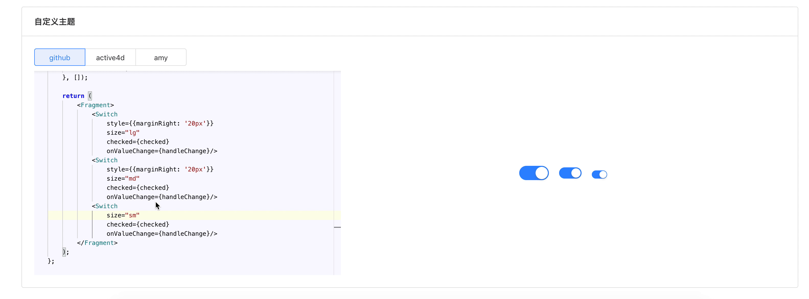

>  基于 `monaco-editor` 的 typescript 编辑器，ui 层提供了 react 实现，可以实时编辑 react 代码并生成预览效果。

该仓库包含2个包：

## react-previewer

typescript 编辑器，可以实时编译、运行代码并生成预览效果。具体使用参考[文档](./packages/react-previewer)。

## ts-editor

基于 [monaco-editor](https://microsoft.github.io/monaco-editor/) 的 typesc 编辑器，支持实时编译、预览。具体使用参考[文档](./packages/ts-editor)。

## dts-bundle

该模块用来对指定 `.d.ts` 文件进行解析，把其包含的类型声明及依赖的类型声明都打包到指定 json 文件里，主要用来生成 `ts-editor` 所需要的 `types`。具体使用参考[文档](./packages/dts-bundle)。

## examples 

examples 提供了一个完整项目用来演示如何开发一个支持 typescript 的 react 实时预览编辑器。